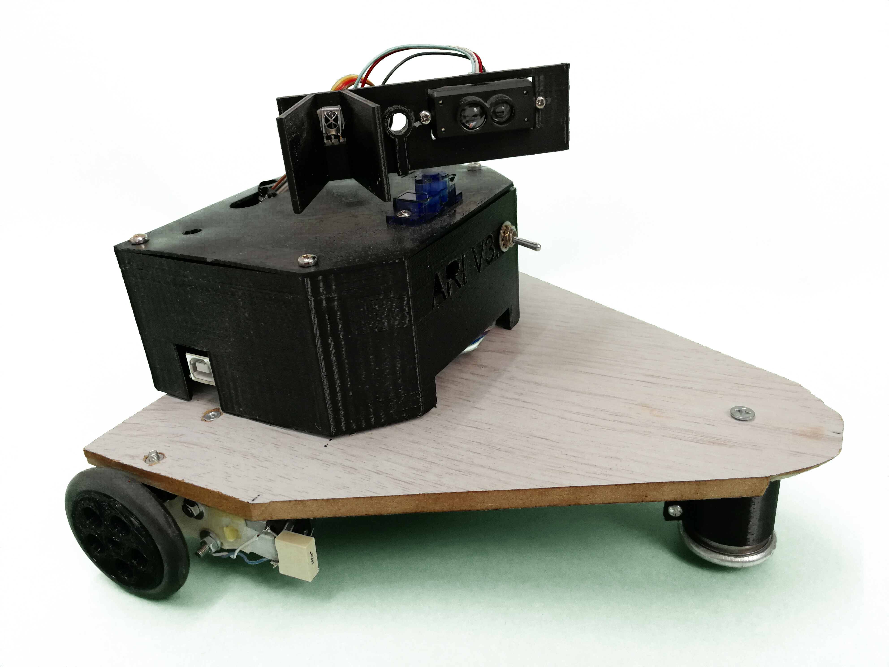

la documentazione è in costruzione.

[TOC]

# ARI_V3

*Arrivo in biblioteca e chiedo “Robinia Blues” di Valter Binaghi, il bibliotecario consulta il computer e mi  informa che c’è e lo posso trovare tra gli autori italiani. Un attimo di imbarazzo, non frequento questo luogo abbastanza da conoscere la disposizione degli scaffali, faccio per domandare ma il mio interlocutore mi anticipa dicendomi di seguire Arianna. Arianna ? Un sibilo mi fa voltare, vedo una macchinina che parte lungo il corridoio, porta la scritta Arianna. Al mio sguardo interrogativo il mio interlocutore mi fa cenno di andare, segua Arianna 
mi dice. Tutto dura pochi secondi nei quali valuto anche la possibilità di essere vittima di “Scherzi a parte”, Arianna si ferma, si gira un poco e con un altro fruscio un puntatore luminoso si muove, si accende e
quando decido di guardare dove Arianna sembra “indicare” vedo una luce sui libri e li vicino il mio “Robina Blues”. Lo prendo, lo sfoglio e me ne vado un poco stupito, saluto il bibliotecario e nel frattempo risento il sibilo. Vedo Arianna che torna da dove era venuta, la vedo accoccolarsi in una piccola casetta e io lascio la biblioteca pronto a rileggere il libro di un bravo insegnante che ha attraversato i nostri luoghi*.

## sul nome

Nasce col nome di Arianna dal filo della sua più famosa omonima, il suo impegno originale era di mostrare la posizione di un libro in biblioteca e poi tornare alla base. Il suo diminutivo è ARI e questa è la sua terza versione 3, da cui ARI_V3.

## obbiettivi

- ARI_V3 è un robot didattico. 
- 
  E'fatto scrivendo il codice da zero per poter capire e poi spiegare tutte le nozioni che servono a farlo funzionare
- Deve poter essere usato senza il timore di romperlo. 
- Deve avere un costo che permetta a ognuno di farselo .
- Deve avere le possibilità di un robot "Grande", permettere di fare le cose che fanno sui robot "seri".

## il risultato

questa è ARI_V3

- Il materiale costa circa 100 €.
- Ha dei motori che gli permettono di muoversi. Sono dotati di encoder sulle ruote, ha quindi un algoritmo di odometria. L'odometria gli permette di sapere dove sta andando.
- Ha un Lidar, un radar laser, montato su un servo che permette di ruotarlo. Questo permette di analizzare gli algoritmi di scansione in due dimensione.
  Gli permette anche di viaggiare mantenendo la distanza da una parete laterale o di seguire una persona.
- Ha una interfaccia WiFi, tramite questa si collega a un pc da dove è possibile inviare comandi ed eseguire programmi che comandano e usano i dati ritornati da ARI.
- monta un puntatore laser per indicare cose, 
- ha un sensore IR per poter tornare a casa quando si perde.
- Ha una interfaccia per bussola magnetica e navigatore inerziale completo.
- ci sono quattro moduli fisici: la parte elettronica di controllo con il relativo contenitore, i due moduli motore-encoder-ruota e la sfera anteriore. Questi possono essere stampati in 3D e assemblati  liberamente.

Ogni suo aspetto può essere studiato senza timore di rompere qualcosa.

# installazione

**ATTENZIONE:** 

per clonare il progetto utilizzare `git clone --recursive https://github.com/stuffcube/ARI_V3.git`

le varie istruzioni sono nel folder:
ARI_V3\00_doc

# uso

# contribuire al progetto

mandaci una email a infostuffcube at gmail dot com. Troveremo il modo di lavorare insieme

# credits

il progetto poggia su Arduino, Python e varie librerie. Le librerie sono listate nelle istruzioni di installazione.

a cura di: [StuffCube](https://stuffcube.wordpress.com/)  & [Digitus Lab](https://www.pedagogia.it/digituslab/)

# Licenza

da definire. è un progetto collaborativo sia come hardware che come software.

